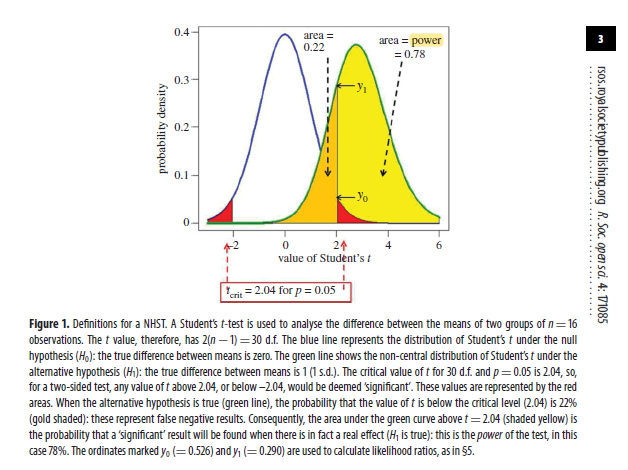
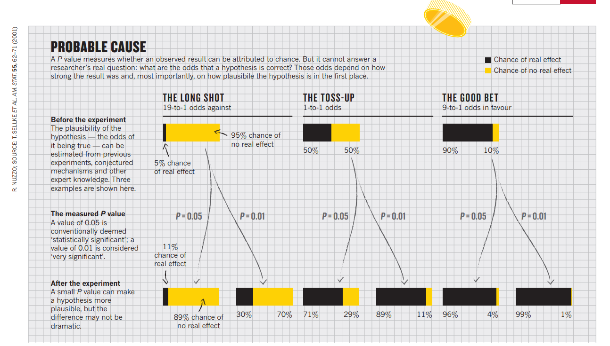
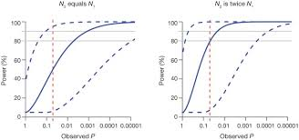
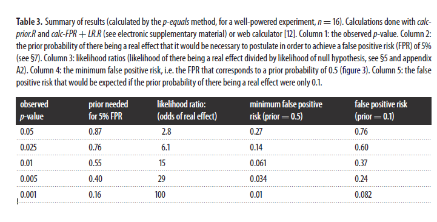
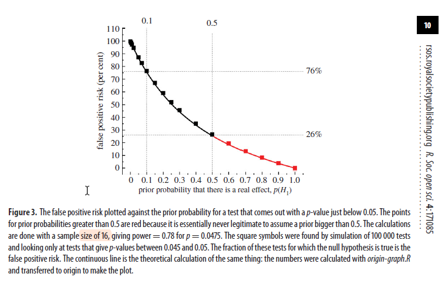
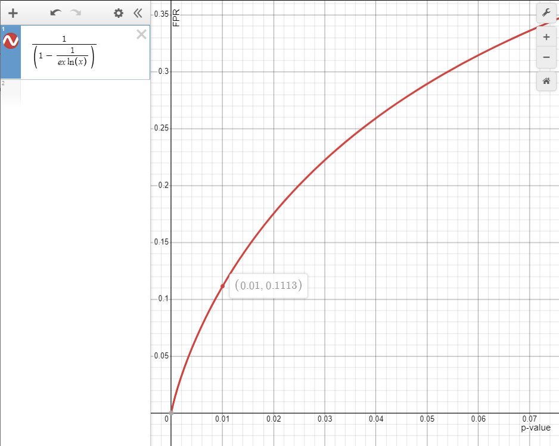
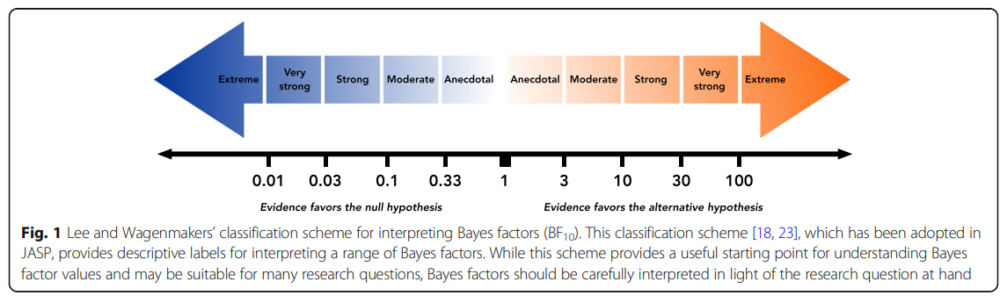
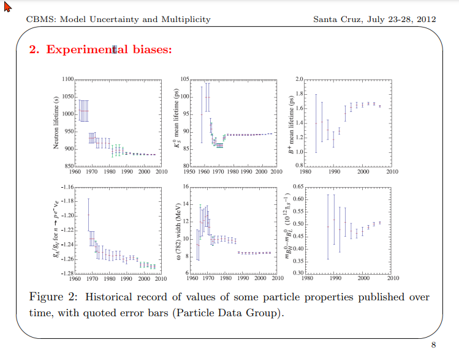
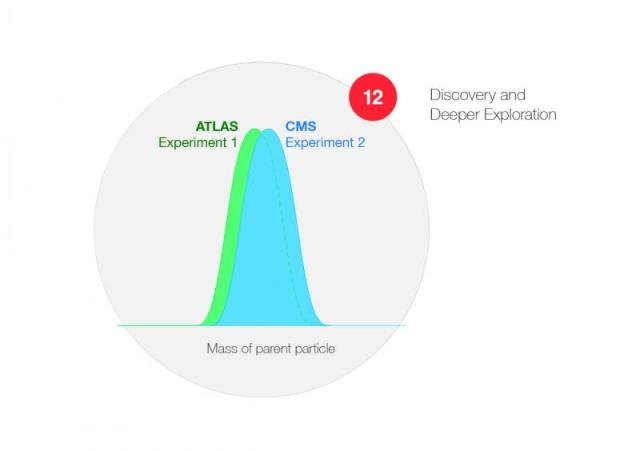
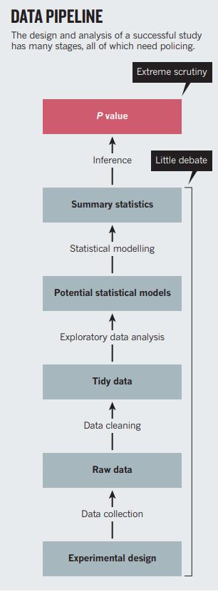

# Research Notes: P-values and other significance pitfalls
A rigorous guide to p-value misinterpretation, False Positive Risk, p-hacking, structural bias, and Bayesian alternatives. Heavy on the maths, but useful to have the foundations in one place.

Research notes by Gilles Demaneuf. [`Git Page`](https://nemonominem.github.io/P-Values_Pitfalls/p-values-pitfalls.html), [`Git repo`](https://github.com/nemonominem/P-Values_Pitfalls) 

> # TLD'R
>
> P-values used in null hypothesis significance testing (NHST) can be extremely misleading. Not only have these p-values by themselves some strong theoretical and practical limitations (discussed in 1.2 below), but, to make things worse, the interpretation of p-values itself is very often wrong, as will be shown in 1.1.
>
> Allied to their already extensive limitations, such common incorrect interpretations about the meaning of the p-value often form a toxic cocktail that results in spurious results being considered significant. The abuse of p-values has largely contributed to the reproducibility crisis in science. That reproducibility crisis is particularly acute in domains with small sample sizes and rather relaxed and liberal use of the p-value, such as social sciences, but it also affects other domains where too much meaning tends to be invested in limited one-off experiments.
>
> If p-values have to be used, to limit their damage, it is recommended that no 'significant' meaning be ever attributed to any p-value > 0.005. Instead any p-value in the 0.005-0.05 range should be deemed just 'suggestive', and even a 'significant' p-value (≤ 0.005) should still be carefully handled (1.4.d). 
>
> Various alternatives to the p-value have been proposed. By large and far, most suggestions draw on a Bayesian approach, while still being able to offer conservative estimates with very reasonable minimal assumptions about priors. The False Positive Risk with its minimal estimate (1.4.c), or the related Bayes Factor, are the most common robust alternatives put forward.
>
> More generally, any significance test needs to be evaluated in the context of possible p-hacking, of possible structural bias in the models or in the data being used. Without such context checks, a significance test may just be the tip of a very weak experimental chain. Its contribution to establishing 'significance' will then just be as weak as the weakest part of the chain (see 'mirage of deductive reasoning' in 1.1 and also sections 2, 3 & 4).
>
> Once all has been duly considered, it then becomes apparent that p-values and the blind application of any statistical test may suffer from a 'mirage of objectivity' (1.2.b). In that sense, not only is the Bayesian requirement for some minimal statement about priors a methodological requirement, but it also represents a sound antidote to such misleading claims to objectivity.

# 1   P-Values

## 1.1 Common misinterpretations:

The following claims about p-values are extremely common and also absolutely wrong:

- 'The p-value is the probability that the result observed occurred by chance'
- 'The p-value is the probability that the null hypothesis is true'
- 'The result is significant because the p-value is below 0.05'

A related methodological claim, made when using p-values, is also wrong and shows a misunderstanding of the scientific method (which could be called the '**mirage of deductive reasoning**'):

- The  probability of a conclusion being in error can be calculated from the data in a single isolated experiment, without reference to the full experimental path trodden, and without reference to external evidence or plausibility of any underlying mechanism.

In fact, p-values by themselves are of limited value. We need another statistical step, which may require some degree of judgment, *plus some methodological care* to make sense of a p-value.

## 1.2 Limitations:

### a. The p-value does not answer the right question:

The p value is a statement about p(data/H0) when what we are actually after is a statement about p(H0/data).

In Bayesian notations, the two quantities are linked by the ratio p(H0)/p(data):  

> *eq1:* p(H0/data) = p(H0)/p(data) x p(data/H0). 

The difference between the two can be described as:

- the difference between inductive reasoning (p(H0/data)) and deductive reasoning (p(data/H0)),
- the error of the transposed conditional, a.k.a. Prosecutor's Fallacy.

Another formulation of the issue in purely deductive terms may be:

Knowing that the data are ‘rare’ when there is no true difference (p(data/H0)) is of little use unless one determines whether or not they are also ‘rare’ when there is a true difference (p(data/H1)).

> He is a simple illustration of the problem:  
>   
> Let's consider a population made in equal parts of 30 year-old males and 13 year-old ones.   
> Let H0 be the hypothesis that based on its weight a given individual in that population is a 13 year-old teenager, H1 the reverse hypothesis that it is a 30 year-old male.
>
> Let's say that 95% of 13-year old males weighs less than 75kg, and 3% between 70 and 75kg. (Our distribution is given in step of 5 kg)
>
> If a random individual weighs between 70 and 75kg, what does the p-value tell us?  
> The conclusion based on the p-value threshold of 0.05 supposing H0 would be that H1 is validated. i.e. that the individual is (likely) a 30 year-old adult, and not a 13 year-old teenager.  
>   
> But how likely? In other words what is P(H0/data)?  
> Let's suppose that 25% of 30-year old males weighs between 70 and 75kg.   
> So 14% of the whole population is in the 70-75kg bucket, with 12.5% (25%/2) contribution from the 30 year-old subset and 1.5% (3%/2) from the 13 year-old subset.
>
> Hence an individual in the 70-75kg bucket has a 12.5%/14% = 89% chance of being a 30 year-old.  
> We still effectively have **11%** of wrongly calling that individual an adult (i.e.: concluding that H1 is true), when it is not (H0 is actually true). That's our false positive risk and it is not 5%.
>
> In particular note that there is no way to answer the proper question p(H0/data) without considering the 30-year old weight distribution, while the p-value itself is based only on the 13-year old weight distribution.

 

This deductive representation of the issue is [illustrated below](https://royalsocietypublishing.org/doi/10.1098/rsos.171085) (note: y0 = 0.0526, not 0.526 as indicated in figure text).

There one can see that p(data/H0) does not mean that H1 is much less likely than H0 given a high value for p(data/H0).   
With a low power test, under H1 the probability that the test value t (using a Student test for small populations) is under the critical level (2.04) is still relatively high at 22%, against 95% for H0.

### b. The chance of a false reported effect is often very high:

In section 1.4 we shall introduce the False Positive Risk (FPR), also called False Discovery Risk, which is the probability of wrongly concluding that there is a size effect (P(H1) is true) when there is none (P(H0) is actually true). 

A popular Nature article made that point through a simple illustration reproduced here:

As we can see, at the very neutral a-priori P(H1) = P(H0) = 0.5 level (a realistic best case for any new discovery setup), the False Positive Risk is at least:

- a whopping ~29% for a p-value of 0.05 and
- still a large ~11% for a p-value of 0.01.

We will explain in 1.4 below how these values are derived via a simple equation. Here are more illustrative values for the FPR in the meantime:

> An interesting implication of this consideration of the use of the p-value in different domains is that **the p-value has been already commonly been informed by a degree of subjectivity**, based on the cost of errors in the confusion matrix (see medical drugs approval in particular) and the typical prior odds in each domain.
>
> There is thus no point pretending that p-values are an objective tool that does not require any prior by contrast to Bayesian methods, since successful applications have grounded themselves in their domain priors.

## 1.3 P-value, test power and sample size:

### a. The role of the test power

Note that the key element in the Null Hypothesis Significance Testing setup is the **power** of the statistical test.  
That power is typically linked to the size of the populations for which some statistics are being compared.

**Small populations (low double digit ones typically) are very prone to p-value abuses as they deliver low-power tests.**  
**For higher populations the p-value taken of its own is much less likely to mislead, but this is not a reason to still confuse p(data/H0) with p(H0/data).**

Basically we do not want to be right part of the time (large populations) for the wrong reason (convergence of p(data/H0) and p(H0/data) in that case).

### b. π interval and power interval:

The p-value prediction interval was introduced in 1.2 as a way to better appreciate how brittle a p-value may be.   
[Lazzeroni *et al*](https://go.gale.com/ps/i.do?p=AONE&u=googlescholar&id=GALE|A441882875&v=2.1&it=r&sid=googleScholar&asid=2d74e422) adds other intervals to the p-value prediction interval:

- **[pi] interval:** P-value confidence interval for the "true population P value" or [pi] value, which is defined as the value of P when parameter estimates equal their unknown population values, noted
- **power interval:** confidence interval for the de facto power of a study, which is the probability of rejecting the null hypothesis given the true, but unknown, population [pi] value

Their results are interesting because they show how likely replication study are to fail, based on any p-value that is more than 0.001.

Quoting from [their paper](https://go.gale.com/ps/i.do?p=AONE&u=googlescholar&id=GALE|A441882875&v=2.1&it=r&sid=googleScholar&asid=2d74e422):

The proposed intervals can be calculated from the original P value alone, without other data. Importantly, they do not depend on the sample size of the study.  
For example, suppose a published study reports a two-sided test with P = 0.049. Using the calculator, the 95% confidence interval for [pi] is found to be [0.000085, 0.99] and barely excludes 1, which is the null value of [pi] for a two-sided test.

This interval and the variability it reflects are exactly the same whether the sample size is 100 or 100,000. The prediction and power intervals require specification of the relative size of the two studies, but not the absolute sample sizes.

Suppose a replication study of the published finding above was planned using the same sample size. The 95% prediction interval for P, which will cover the actual follow-up P value 95% of the time, is [0.0000021, 1], demonstrating how uncertain the outcome of the same-sized replication study would be.

The 90% confidence interval for de facto power is [0.062, 0.951] and conveys a similar message. For an initial finding of P = 0.049 with any sample size, there can be little confidence in the power of a same-sized replication study.

If, instead, the initial finding is P = 0.001, the 95% [pi] interval is [0.00000015, 0.18]; the 95% prediction interval is [0.0000000013, 0.60]; and the 90% power interval is [0.377, 0.999]. Despite the fact that P = 0.001 is usually thought to be a highly significant finding, nonsignificant results in a same-sized replication study cannot be considered surprising.

In fact, an initial finding of P < 0.00001 is needed to have 95% confidence that a same-sized replication study will have 80% power; P < 0.0003 is needed if the replication study is twice the size of the original study (Fig. 1 below). Furthermore, trying to replicate an initial test result of P = 0.05 with the same sample size gives 50% confidence of having 50% power to detect an effect in the same direction, but a sample 79 times that size is needed to ensure 95% confidence of having 80% power.

*Confidence limits for power based on observed p-value. Estimated de factor power (solid blue curve) and 80% confidence limits (dashed blue curves) for study 2 with sample size N2 based on an observed p-value from study 1 with sample size N1. Assumes a two-sided test at significance level α = 0.05. Dashed red vertical line is at p-value = 0.05, and solid gray horizontal lines at 80% and 90% power.*

## 1.4 Recommended complement to p-value - the False Positive Risk:

### a. Need for a 2-step process:

Based on the above, it is essential to use p-values with the utmost care. A good way to proceed with p-values is to:

1. Control the messaging about p-value in all communications with the stake-holders so as to avoid common confusions.

2. Complement the p-value with an estimate of the FPR (False Positive Risk, also called FDR for False Discovery Risk)which is the true probability that the result observed happened by chance, even when the p-value is so small and/or the sample size is so large as to be most likely truly significant due to a high power test statistics.

Let's explore the reason for these two pieces of advice:

1. Control the messaging about p-value in all communications with the stake-holders so as to avoid common confusions.

The p-value is one of the most commonly misunderstood statistic, often resulting in wrong conclusion being reached about the true significance of some result.

- Never use p-values on their own. Any such claim would be a statement of p(data/H0) which is of no interest and necessarily misleading.
- Actually neveruse the term significant in relation to a p-value on its own.
- without giving first an estimate of the False Positive Risk (the true probability the the result observed by chance, see recommendation 2)

2. Complement the p-value with an estimate of the FPR (False Positive Risk, also called FDR for False Discovery Risk), even when the p-value is so small and/or the sample size is so large as to be necessarily truly significant.

While adding 'supposing H0 is true' to 'The p-value is the probability that the result observed occurred by chance' is at least technically correct, it still does not validate the statistical significance of the result.   
So effectively even a correct formulation of the p-value is in itself totally insufficient to deliver what is needed. One needs to go beyond the p-value for that.

A simple way to keep using the p-value while avoiding confusion and ensuring that we assert properly the significance of the result is thus to:

- State explicitly that 'The calculation of the p-value is a first step towards establishing significance of the result, but is not sufficient in itself.'
- Then adds that 'Significance of the p-value result is then checked by calculating the False Positive Risk, which is the the posterior probability that the null hypothesis is true, or said otherwise that the result happened by chance'

Effectively the p-value itself is only the first step in a 2-step statistical process to determine the significance of a single experiment. The required second step is the determination of the FPR, which can be calculated online **[at this site](http://fpr-calc.ucl.ac.uk/)****.**

> **Definition:**
>
> **The False Positive Risk is the the posterior probability that the null hypothesis is true:**
>
> **FPR = p(H0/data)**
>
> **2-step process for the statistical significance of a single experiment using p-value: 'P-value + FPR':**
>
> 1. calculate p-value
> 2. suppose a given p(H0) ≥ 0.5 and calculate the corresponding False Positive Risk.
>
> BOTH values need to be consistent with a significant result (at their respective level of comfort) for the single experiment to be significant.  
>   
> note: For (2) 0.5 is a fairly neutral value but use some common sense to decide if a larger value is warranted.

### b. False Positive Risk and test power:

Let's note that there are two main situations that will govern our relation to the test power:

1. In most Data Science applications at BNZ we design a model by using past events and the populations are therefore given. We have to use whatever clean data we can, while being careful of any sampling bias introduced by the cleaning, and this results is a given test power.
2. Still we usually run an experiment before putting such model in production, so there at least we are able to aim for a certain power and population size. Additionally there is plenty of A/B testing in BNZ digital where such situation is the standard. In these cases where we are designing an experiment with data still to be collected, we can use our control on the population sizes (within reasonable bounds). So one can estimate the sample size that will give a test power of close to 0.80 or even better 0.90 and use that size. See this A/B Testing [calculator](https://abtestguide.com/abtestsize/) and also [this one](https://www.evanmiller.org/ab-testing/sample-size.html#!0.5;80;5;10;1) for the determination of the sample size.

In situation (2) the standard in the literature is to suppose a '**well-powered**' test power of 0.80 for most examples.  
In terms of Null Hypothesis Significance Test, this translates as a population of 16 for an effect size of 1 stdev (using a Student t distribution for small populations).

### c. Calculation of FPR:

In this section we will show that an exact calculation of the FPR requires using a reasoned subjective value for the prior odds ratio.

But we will also show that in any case a minimal reasonable value for the FPR can easily be derived.

This minimum boundary thus plays a key role in illustrating the best case scenario, as it has the advantage of not requiring any subjective value for the prior odds (only a very reasonable assumption in a discovery test context is required) while its value is itself already very telling as to the limitations of p-values in many situations. 

**c.1 Calculation of Likelihood ratio (a.k.a Bayes Factor):**

Let's remember that formulation of Bayes' theorem in terms of update via the **Likelihood ratio**:

>*eq2:* p(H1/data)/p(H0/data)  = p(data/H1)/p(data/H0) × p(H1)/p(H0)
>
>       posterior odds ratio      = likelihood ratio             × prior odds ratio

The likelihood ratio is also be called '**Bayes factor**'.  
Note that the Bayes Factor is totally independent of any selecting any **subjective** value for p(H0) or p(H1).  
The Bayes Factor is an **objective** transformation factor, that can be applied to subjective probabilities to see how these change when evidence is introduced.  
The log of the Bayes Factor is also called the '**weight of evidence**' and is additive across independent evidences.

Additionally we can avoid selecting any subjective value for p(H0) for considering that **at most** p(H1) = P(H0) in a discovery set up.  
From this we see that the Bayes Factor (H1 vs H0) becomes  a maximal value of the posterior odds (H1 vs H0).

Going back to Figure 1 above, one can show that more generally (see section A.2 of [Colquhoun](https://royalsocietypublishing.org/doi/10.1098/rsos.171085) for details):

>*eq3:*    likelihood ratio(H1 vs. H0) = y1 / (2 x y0)

**Illustration using Figure 1:**
>
> For a p-value of 0.05 with a test power of 0.8:
>
> - p(data/H1) = p1 = y1 ~ **0.29** and
> - p(data/H0) = p0 = 2 x y0 ~ 2 x 0.0526 ~ **0.105**
>
> hence Likelihood ratio(H1 vs. H0) ~ 0.29 / (2\*0.0526) 
>
> so Likelihood ratio = Bayes Factor ~ **2.76** 
>
> Let's note that that value is much less than the false 20 derived from p = 0.05 (when one wrongly supposes that p = 0.05 is the probability that H0 is true).

**c.2 Boundary value: Derivation of FPR when prior odds ratio is 1:**

One particular case of the posterior odds ratio formula above when the prior odds are 1 (i.e. the prior probability of there being a real effect is 0.5).  
In that case the he posterior odds are equal to the likelihood ratio (a.k.a Bayes Factor).

Since it is not normally considered acceptable to be optimistic about H1 to the point of supposing p(H1) > 0.5 before doing the experiment, one can see that in all acceptable cases the prior odds ratio ratio will be at least 1, so that likelihood ratio is effectively the **maximum value** of the posterior odds ratio under the reasonable value domain for p(H1) (p(H1) ≤ 0.5)

Hence

> *eq4:*    posterior odds ratio ≤ likelihood ratio(H1 vs H0)                for p(H1) ≤ 0.5 

From probability = odds/(1+odds), considering p(H0/data) and **supposing that the prior odds ratio (p(H1)/p(H0)) is1**, we get

>p(H0/data) = p(H1/data) / likelihood ratio
>
>p(H0/data) = (1-p(H0/data)) / likelihood ratio
>
>*eq5:*    FPR = p(H0/data) = 1/(1 + likelihood ratio)                                        (supposing prior odds ratio = 1)
>
>Which can also be written as:
>
>*eq6:*    FPR = p(H0/data) = p(data/H0)/ [p(data/H0) + p(data/H1)]              (supposing prior odds ratio = 1)

**Illustration using Figure 1:**
>
> For a p-value of 0.05 with a test power of 0.8:
>
> FPR = p(H0/data) ~ 1 /(1+2.76), using eq5
>
> or FPR = p(H0/data)~ 0.105 / (0.105 + 0.29), using eq6
>
> Hence **FPR = 0.266 (supposing prior odds ratio is 1)**

**c.3 General direct calculation of FPR and relation to boundary value****:**

One typically never supposes that the prior odds ratio (p(H1)/p(H0)) is more than 1, i.e: that p(H1) > 0.5, which would be twisting the test in favor of the H1 result - a cardinal sin in the context of testing for a discovery.  
So the practical maximum for that ratio is 1.

More precisely analyses of replication result  [suggest](https://www.nature.com/articles/s41562-017-0189-z) that for psychology experiments, the prior odds of *H* 1 to *H* 0 may be only about 1:10, meaning P(H1) ~ 0.1. A similar number has been suggested in cancer clinical trials, and the number is likely to be much lower in preclinical biomedical research.

Practically in Data Science when working on marginal relations with weak data, one should be conservative and consider P(H1) ~ 0.1 as a distinct possibility. And that's before considering other potential issues, such as p-hacking which is rather common in these marginal situations.

If we do not ignore p(H1)/p(H0) the eq6 just simply becomes:

>*eq7:*    p(H0/data) = p(H0) x p(data/H0)/ (p(H0) x p(data/H0) + p(H1) x p(data/H1))

or

>*eq8:*     p(H0/data) = p(data/H0)/ (p(data/H0) + [p(H1)/P(H0)] x p(data/H1))

As the prior odds ratio p(H1)/p(H0) should never be > 1 in a discovery setup, and in most situation much lower than 1, we can see that practically:

p(data/H0)/ (p(data/H0) + [p(H1)/p(H0)] x p(data/H1)) ≥ p(data/H0)/ [p(data/H0) + p(data/H1)]

In other words the exact value of p(H0/data) over the reasonable range for the prior odds ratio is never less than the value of p(H0/data) for prior odds ratio = 1

Hence the value of FPR given by eq6 acts as a minimum boundary for the exact value of the FPR given by eq7, over the reasonable range for the prior odds ratio.

> **Illustration using Figure 1:**
>
> For a p-value of 0.05 with a test power of 0.8:
>
> We start with an a-priori estimate of P(H1) ~ 0.1 (prior odds ratio ~ 1/9) which is in line with a-posteriori estimates for discovery tests in social sciences and rather conservative for drug treatments validation. 
>
> As per c1 above, p(data/H1) ~ 0.29 and p(data/H0) ~ 0.105, hence eq8 gives
>
> FPR = p(H0/data) ~ 0.105 / (0.105 + 0.1/0.9 x 0.29)
>
> **FPR ~ 0.765   (supposing prior odds ratio is 1/9)**
>
> This is nearly 3 times the minimal bound of 0.266 given by a prior odds ratio of 1.

### d. Practical examples:

This [link](http://fpr-calc.ucl.ac.uk/) provides a calculator for the FPR. Please use it.

For a p-value of 0.05 and a well-powered sample size (n=16, power=0.78), the FPR is:

- 76% if one supposes p(H1) = 0.1 (adversarial)      (→ in this case we have an exact FPR)
- 26% if one supposes p(H1) = 0.5 (neutral)          (→ in this case we have the minimum FPR over the reasonable range for P(H0), i.e. p(H0) ≥ 0.5)

note: 26% in the best situation is much higher than the often wrongly interpreted 5%. Basically there is no sound basis to reject H0 at that level of p-value.

For a p-value of 0.0079 and a well-powered sample size (n=16, power=0.78), the FPR is:

- 5% if one supposes p(H1) = 0.5

note: 0.5 is the most optimistic value for P(H1), so we typically need a p-value that is less than 0.0079 to make sure that the probability of a false positive (seeing a size effect where there is none) is 5%.  
This is a very small p-value.

For a p-value of 0.005 and a well-powered sample size (n=16, power=0.78), the minimum FPR is:

- 24% if one supposes p(H1) = 0.1 (adversarial)
- 3.4% if one supposes p(H1) = 0.5 (neutral)

note: 3.4% is good but this grows to minimum 24% if P(H1) is 0.1 instead. Hence it is still a rather marginal level of confidence in the adversarial case.

This was nevertheless the basis of recommendation [published in Nature](https://www.nature.com/articles/s41562-017-0189-z) to move the **'significant'** criteria to **0.005** while keeping the p-value, and to call any result based on a p-value between 0.,005 and **0.05** as '**suggestive**'.

For a p-value of 0.001 and a well-powered sample size (n=16, power=0.78), the minimum FPR is:

- 8% if one supposes p(H1) = 0.1

note: this is still high if p(H1) = 0.1 but start getting acceptable. One would actually need p=0.00045 to bring the minimum FPR to 5%.

## Take-away:

**1.** A p-value of around 0.001 and not 0.05 is compatible with a probability of 5% for a false positive (seeing a size effect where there is none) within a reasonable range for p(H1) and a common standard test power of 0.8. 

**2.** If p-value are to be used, some authors have recommended that - as a lesser evil - at the very least the 'significant' criteria should be moved down to 0.005, while still understanding all the limitations of NHST.

*(note: typically one does not consider p(H1) > 0.5 out of necessary conservatism, hence the red part of the curve above)*

### e. Approximation of minimal FPR value through the likelihood (Bayes Factor):

With the usual reasonable hypothesis that p(H1) ≤0.5, we can derive an approximation for min(FPR) using the approximation for the Bayes Factor given in 1.5.b.

> **FPR ≥ 1/[1 - 1/(e p ln(p))]                          (p(H1) ≤0.5)**

The steepness of the [FPR curve](https://www.desmos.com/calculator/t6kjhyzqhf) (given for for p(H1 = 0.5) is striking and perfectly illustrate why the p-value is an unreliable guide.

*Approximation of FPR minimal value as a function of **p-value** (calculated at P(H1) = 0.5)*

This approximation is slightly above the values given in 1.4.d above, which are based on the more precise [David Colquhoun's approach](https://royalsocietypublishing.org/doi/10.1098/rsos.171085).  
However the approximation is rather simple. It is developed also in [Selke et al](https://www.jstor.org/stable/2685531), which was the basis of an oft reproduced illustration in a [Nature article](https://www.nature.com/articles/506150a) we saw earlier.

## 1.5 Alternative complements to p-value

### a. The reverse Bayesian method:

David Colquhoun proposed an [alternative approach](https://royalsocietypublishing.org/doi/10.1098/rsos.171085) which does without having to consider a specific reasonable p(H1) (≤ 0.5): the **reverse Bayesian method**.

Calculate what p(H1) prior probability would be needed to achieve a specified (desirable) false positive risk (see the [web calculator](http://fpr-calc.ucl.ac.uk/)).   
**If this prior is bigger than 0.5,** then you are **not** on safe ground if you claim to have discovered a real effect.   
**If the calculated prior is less than 0.5** then it is up to you to argue that the calculated prior is plausible, and up to the reader to judge whether or not they are convinced by your argument.

For example, p=0.005 would require a p(H1) prior of 0.4 in order to achieve a 5% false positive risk. So, if you observe p=0.005 and you are happy with a 5% false positive risk, it is up to you, and the reader, to judge whether or not the p(H1) prior of 0.4 is reasonable or not. This judgement is largely subjective, and people will disagree about it. But inference has to involve subjectivity somewhere.  
Calculation of the prior seems to me to be a better way than specifying an arbitrary prior in order to calculate an FPR.

### b. The Bayes Factor: is the odds of H1 to H0 given the observed data, basically the likelihood ratio of 1.4.c above.

For example, a Bayes factor of 5 indicates that the strength of evidence is five times greater for the alternative hypothesis than the null hypothesis given the observed data.  
  
A general controversy of the Bayesian approach is the need for you to specify your strength of belief in the effect being studied before the experiment takes place (the prior distribution of the alternative hypothesis).  
This criticism of Bayesian statistics is often exaggerated because the influence of the prior may be limited when a reasonable prior distribution is used, and because there is also a default prior that one can use in the common situation when one has little pre-study evidence for the expected effect size.

Fortunately, there is a single, simple formula that one can apply to convert a p-value to a form of the Bayes factor without any other information. This simplified form, termed the **Bayes factor upper bound**, states the most likely it is that the alternative hypothesis is true rather than the null hypothesis over any reasonable prior distribution.

*Lee and Wagenmakers’ classification scheme for interpreting Bayes factors (BF10, odds of H1 to H0)*

For example, if the data produces a *p*-value of 0.07 (sometimes termed a ‘trend’), the Bayes factor upper bound is 1.98 and one can conclude that the alternative hypothesis is at most twice as likely as the null hypothesis (FPR ≥ 0.33).

> **Bayes  factor  upper  bound  ≤ –1 / [e x p x ln(p)]**

 A calculator for the Bayes factor is available [here](https://harry-tattan-birch.shinyapps.io/bayes-factor-calculator/). 

Here is another calculation example for a p-value of 0.05:

> Bayes Factor ≤ ~ -1 / (2.718 x 0.05 x ln(0.05))
> 
> **Bayes Factor ≤ 2.46**

And to show the link to the FPR:

> P(H1/data) / P(H0/data) ≤ 2.46
>
> (1-  P(H0/data)) / P(H0/data) ≤ 2.46
>
>P(H0/data) ≥ 1/(1+2.46)
>
>**FPR ≥ 0.289**

# 2   P-hacking

Always keep in mind the following necessary condition for the 2-step 'p-value + FPR' process to be valid, especially when dealing with small samples.  
This actually is largely true for any testing process:

**The experiment should be unique and not one cherry-picked out of a long series.**

This is one form of the so-called [Texas sharpshooter](https://www.nature.com/articles/526182a) problem, whereby one unknowingly develops a pseudo-scientific narrative around a random result by ignoring the decisions that resulted in the selection of that specific result.  
This is extremely easily done by not recording these decisions and previous attempts, including previous usage of the supposedly unseen data along the way to this circling around a specific experiment.

Also a simple serial attempt at significance tests for various population statistics will eventually bring a false positive, if enough attempts are performed.  
This is not any different than saying that the max of n normal(0, 1) samples is not 0, and the higher n then the deeper that max moves within the right tail of the normal distribution. The max is a simple form of selection, and any form of selection biases the measured value (the max here) away from the true mean (zero in this case).

The key idea is that the real experiment is the set of all the filtering, selection and eventual experiments attempted, including all the experiments that failed, and the one lucky experiment is just the necessarily biased tail sampling of that distribution of individual experiment results, possibly reinforced by unrecorded filtering and selections on the way.

A good example is social sciences where data dredging is rife (alternative hypotheses tried and proven false are not disclosed) and where unfortunately sample sizes are also small.  
In such a set-up it is easy to get a marginal result by virtue or problem # 1 (when it is much worse than marginal) and then to push into supposed significance by virtue of Problem # 2 (we cherry picked it after many failed experiments).

Note that the same scenario can play in BNZ Analytics, when looking at very weak tests (due to small population sizes) and look scanning many features to try to find a separating one.  
This is particularly dangerous when there is otherwise no strong partition - all the fishing we can do is the bottom fishing (data dredging) which is bound to eventually return some artifact if we fish long enough and/or casually enough.

# 3 Structural model issues

Another necessary condition typically applicable to most significance statistical test is worth keeping in mind:

**The experiment is unbiased,** so that the underlying comparison of some population statistic between different subgroups make sense.

A good illustration of model bias was [provided by James Berger](https://cbms-mum.soe.ucsc.edu/lecture1.pdf) in the following slide where we can see how confidence intervals shifted over time as model bias was slowly resolved, in such a way that the model bias shifts actually contradict the confidence intervals.

Structural modelling issues may create biases but may be very difficult to detect unless one uses at least **two independent experiments**.  
The 'two independent experiments' approach is actually a standard approach in particular physics, with for instance two different detectors required to validate key results at the CERN (typically ATLAS and CMS, [two multipurpose detectors run by two different teams](https://home.cern/science/physics/12-steps-idea-discovery) so as to ensure true independence).

A version of the two-experiment approach is also the basis of [some US Food and Drug Administration recommendation](https://bmcmedresmethodol.biomedcentral.com/articles/10.1186/s12874-019-0865-y) regarding the usage of p-values.   
  
However typically BNZ Data Science applications do not lend themselves to that **two independent experiments** approach, so we need to keep in mind structural 'model' issues.

# 4 (non)Random sampling

Another necessary condition typically applicable to most significance statistical test is worth keeping in mind:

**Populations are randomly sampled,** so that well defined test statistics may be used.

Most statistical tests (Student t for small populations,  Chi square, etc) suppose random sampling. If that is not the case, the statistical cut-off values used may be overly optimistic.  
  
Of particular relevance here are **possible structural data cleaning/filtering issues** - basically is that data used representative (i.e. randomly sampled) after all the implicit and explicit filtering and cleaning done?  
Are instead biases introduced instead? If so may these biases additionally differ across the different populations considered for comparison?

A good introduction to a more comprehensive overview of the problem was published [in a Nature article](https://www.nature.com/articles/520612a) which is worth reading.  

Similarly some authors (see Greenland et al referenced below) also insist on the many assumptions that may lurk behind a p-value, including data dredging by ignoring intermediate failed directions and experiments:

> We will adopt a more general view of the P value as a statistical summary of the compatibility between the observed data and what we would predict or expect to see if we knew the entire statistical model (all the assumptions used to compute the P value) were correct. (...)
>
> The P value is then the probability that the chosen test statistic would have been at least as large as its observed value if every model assumption were correct, including the test hypothesis. (...)
>
> Furthermore, these assumptions include far more than what are traditionally presented as modeling or probability assumptions—they include assumptions about the conduct of the analysis, for example that intermediate analysis results were not used to determine which analyses would be presented.

## References:

A very good accessible book about the debacle of the p-Value and, more generally, of Frequentist probabilities, is Aubrey Clayton's [Bernoulli's Fallacy](https://aubreyclayton.com/bernoulli).
If the maths above do your head in, that book is nothing like that and adds an excellent g… *(sentence cut off in source)*

**Key papers referenced in this document:**

- [`TOP_rsos.171085.pdf`](https://nemonominem.github.io/P-Values_Pitfalls/articles/TOP_rsos.171085.pdf) — Very good review of FPR
- [`VTOP_dickson_p-values_november_15_2018_rt.pdf`](https://nemonominem.github.io/P-Values_Pitfalls/articles/VTOP_dickson_p-values_november_15_2018_rt.pdf) — Nice presentation on p-values limitations
- [`TOP_rsbl.2019.0174.pdf`](https://nemonominem.github.io/P-Values_Pitfalls/articles/TOP_rsbl.2019.0174.pdf) — p-value is over: alternative analyses
- [`TOP_bdc0702160fd16293b45673ae8c1d5503e9b.pdf`](https://nemonominem.github.io/P-Values_Pitfalls/articles/TOP_bdc0702160fd16293b45673ae8c1d5503e9b.pdf) — Good for section 3 on solutions for reproducible research
- [`TOP_10654_2016_Article_149.pdf`](https://nemonominem.github.io/P-Values_Pitfalls/articles/TOP_10654_2016_Article_149.pdf) — 25 misinterpretations of P values, confidence intervals, and power
- [`TOP_Of_P_Values_and_Bayes__A_Modest_Proposal.6.pdf`](https://nemonominem.github.io/P-Values_Pitfalls/articles/TOP_Of_P_Values_and_Bayes__A_Modest_Proposal.6.pdf) — Good for Bayes factor
- [`TOP_RedefineStatisticalSignificance.pdf`](https://nemonominem.github.io/P-Values_Pitfalls/articles/TOP_RedefineStatisticalSignificance.pdf) — Nature proposal for a 0.005 threshold
- [`TOP_CummingPerspPsychSci2008.pdf`](https://nemonominem.github.io/P-Values_Pitfalls/articles/TOP_CummingPerspPsychSci2008.pdf) — Good on prediction intervals and reproducibility
- [`VTOP_TowardEvidenceBasedMedicalStatistics_P1.pdf`](https://nemonominem.github.io/P-Values_Pitfalls/articles/VTOP_TowardEvidenceBasedMedicalStatistics_P1.pdf) — Excellent introduction by Goodman, part 1
- [`VTOP_TowardEvidenceBasedMedicalStatistics_P2.pdf`](https://nemonominem.github.io/P-Values_Pitfalls/articles/VTOP_TowardEvidenceBasedMedicalStatistics_P2.pdf) — Excellent introduction by Goodman, part 2
